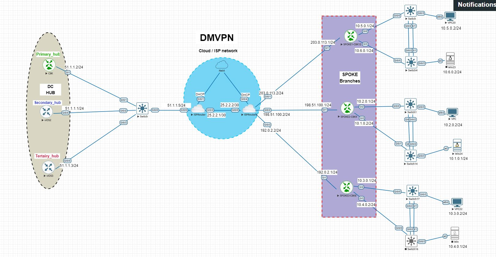

# DMVPN with IPsec – Enterprise WAN Lab
Enterprise WAN lab implementing multi-hub DMVPN with IPsec and EIGRP

## 📌 Project Overview
This project demonstrates the design, implementation, and troubleshooting of a **secure enterprise WAN** using **Dynamic Multipoint VPN (DMVPN) with IPsec**.  
The lab reflects real-world enterprise networking scenarios, focusing on **scalability, security, redundancy, and operational stability** rather than textbook-only configurations.

A **multi-hub, multi-spoke DMVPN architecture** was implemented to simulate how large organizations securely connect multiple branch sites over an untrusted network such as the Internet.

---

## 🎯 Project Objectives
- Design a scalable WAN using DMVPN
- Secure GRE tunnels using IPsec
- Implement multiple hubs for redundancy and failover
- Enable dynamic spoke registration with NHRP
- Run a dynamic routing protocol over DMVPN
- Validate hub-to-spoke and spoke-to-spoke connectivity
- Troubleshoot real-world DMVPN and routing behavior

---

## 🌍 Why DMVPN?
DMVPN is widely used in enterprise networks because it:
- Eliminates the need for static full-mesh VPNs
- Scales easily as new branch sites are added
- Reduces configuration and operational overhead
- Supports spoke-to-spoke communication for optimal traffic paths
- Works seamlessly with IPsec for secure WAN connectivity

This lab highlights how DMVPN behaves **in practice**, not just in theory.

---

## 🏗 Network Topology
The topology consists of:
- **Multiple Hub Routers** – providing redundancy and control-plane services
- **Multiple Spoke Routers** – representing branch offices
- **Simulated Public Network** – representing the Internet
- **GRE over IPsec tunnels** – securing all traffic

📐 **Topology Diagram:**  

---

## 🔐 Security Design – IPsec
All DMVPN tunnels are protected using **IPsec**, ensuring:
- Confidentiality of data in transit
- Integrity and authentication of tunnel traffic
- Secure routing protocol exchanges

GRE provides flexibility for routing, while IPsec ensures enterprise-grade security.

---

## 🔁 Routing Design
- A dynamic routing protocol runs over the DMVPN tunnels
- Single autonomous system used across hubs and spokes
- Routing behavior tuned for stability in a multi-hub environment
- Emphasis placed on **realistic enterprise routing behavior**, not idealized lab behavior

---

## 🧪 Verification & Validation
Connectivity and control-plane behavior were verified using standard IOS commands, including:
- Tunnel and NHRP status verification
- Routing table and neighbor inspection
- IPsec Security Association validation
- End-to-end traffic testing between sites

Verification outputs are included in the (verification/) directory.

---

## ⚠️ Challenges & Troubleshooting (Key Learning Area)

### Challenges Faced
- **EIGRP adjacency flapping** when multiple hubs were introduced
- **DMVPN Phase 3 shortcut behavior** not always installing as expected
- Increased complexity when mixing redundancy, routing, and NHRP behavior
- Differences between theoretical designs and behavior in virtual lab environments

### How Issues Were Isolated
- Verified tunnel and IPsec status before routing analysis
- Isolated routing behavior by temporarily removing protocols from secondary hubs
- Confirmed traffic paths to ensure proper hub transit
- Incrementally reintroduced features to identify instability sources

### Key Lessons Learned
- Multi-hub DMVPN designs require intentional routing control
- Routing protocols do not inherently understand hub preference
- Stability often matters more than full optimization in production networks
- Deep protocol understanding is more valuable than configuration memorization

This section reflects real enterprise troubleshooting scenarios and decision-making.

---

## 📁 Repository Structure
dmvpn-ipsec-enterprise-wan-lab/
│
├── README.md
├── diagrams/
│ └── dmvpn-topology.JPG
├── configs/
│ ├── hubs/
│ └── spokes/
├── verification/
│ └── Screenshots
└── docs/
└── DMVPN with IPsec_documentation.pdf

---

## 🧠 Skills Demonstrated
- Enterprise WAN design
- DMVPN (multi-hub, multi-spoke)
- GRE over IPsec
- NHRP (NHS, redirect, shortcut)
- Dynamic routing over VPN
- Structured troubleshooting
- Network documentation and design thinking

---

## 🚀 Conclusion
This project represents a **realistic enterprise WAN deployment**, emphasizing security, scalability, and operational stability.  
It demonstrates not only the ability to configure complex technologies, but also to **analyze, troubleshoot, and adapt designs** based on real-world behavior.

---

## 📌 Author
**Mbah Ulrich**  
Network Security Engineer | Enterprise WAN | Cisco Technologies  

Open to opportunities, mentorship, and technical discussions.
